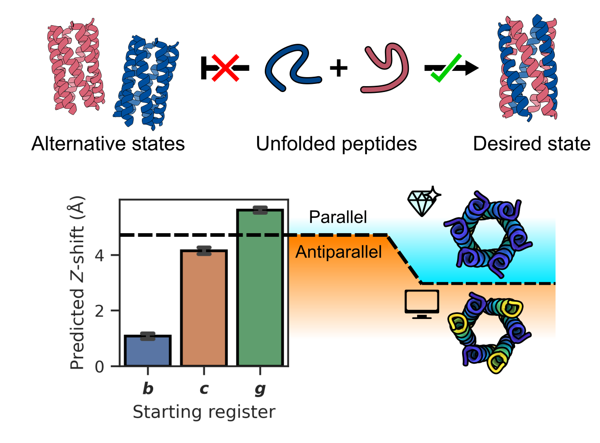

# Code for the A3B3 heterohexamer paper



Code to generate and analyse data used in the ["*De novo* design of parallel and antiparallel A3B3 heterohexameric α-helical barrels"](https://www.biorxiv.org/content/10.1101/2024.09.25.614870v1) paper.

**Authors**: Joel J. Chubb, Katherine I. Albanese, Alison Rodger, and Derek N. Woolfson.

*Correspondence should be addressed to*: <D.N.Woolfson@bristol.ac.uk>

---

## Data Availability

All original data files can be found at the [Zenodo repository]().

---

## Requirements

The code requires some external programs to run and reproduce the results:

- [ColabFold](https://github.com/YoshitakaMo/localcolabfold) for structure prediction (Version 1.5.3)
- [USalign](https://github.com/pylelab/USalign) for structure alignment (Version 20240319)

The work was done using Python 3.10.9. The following Python packages are required:

- `cython==3.0.11`
- `ampal==1.4.0`
- `pandas==1.5.3`
- `seaborn==0.12.2`
- `matplotlib==3.7.0`
- `scipy==1.11.4`
- `numpy==1.26.4`
- `sklearn==1.3.2`

---

## Installation

To install external programs, please refer to the provided links. To install the necessary Python packages, run:

```bash
pip install cython==3.0.11 ampal==1.4.0 pandas==1.5.3 seaborn==0.12.2 matplotlib==3.7.0 scipy==1.11.4 numpy==1.26.4 sklearn==1.3.2
```

---

## Data Generation

All code needed to reproduce the results and analyse outputs is provided. Follow these steps:

1. Specify an output directory and run the script from this directory to generate structure predictions:

    ```bash
    bash ./scripts/run_ColabFold.sh <OUTPUT_DIR>

    # Example:
    # bash ./scripts/run_ColabFold.sh ./data/colabfold
    ```

    > **Note:** this will generate a large number of files in `OUTPUT_DIR` (~ 7,000 files, ~ 0.75 GB).

2. Once predictions are done, analyze the structures and cluster results using the notebook (`./notebooks/data_analysis.ipynb`).

> **Note**: ColabFold was run on an NVIDIA RTX A5500. Outputs may vary depending on your system's configuration.

---

## Data Visualisation

The directory also contains IPython notebooks to create all of the data plots used in the manuscript (`./notebooks/MS_figure_code.ipynb`) and the supplementary materials (`./notebooks/SM_figure_code.ipynb`).

**Note:** the output filepaths are hardcoded for out directory hierarchy. These will need to be changed on a per user basis.
